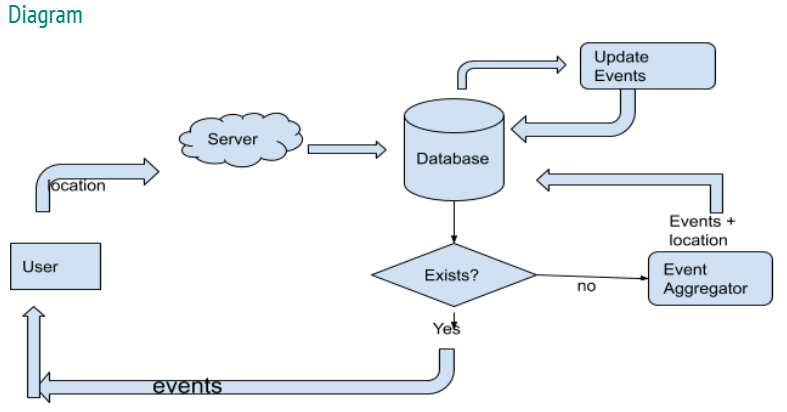

# EHServerSide
Server Side functionality including REST API hosting and module to populate events

## Server Architecture

## Event Aggregation Pipeline

## Important Links
#### [MongoDB Atlas Project](https://cloud.mongodb.com/v2/5f11c4bedce68c1b046d477a#clusters)
#### [Event Pipeline Specifications](https://docs.google.com/document/d/1LtYu7GsE3GkyarR64BEOXA1TbmIn71SkG5B7ZppluqM/edit#)
